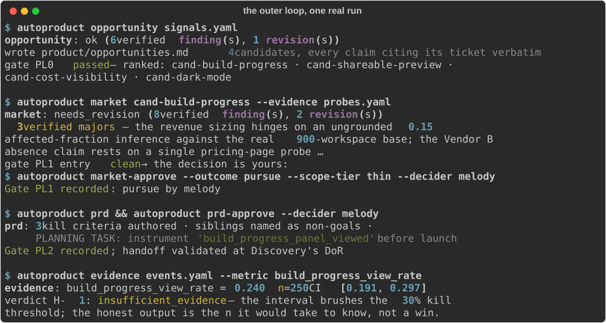
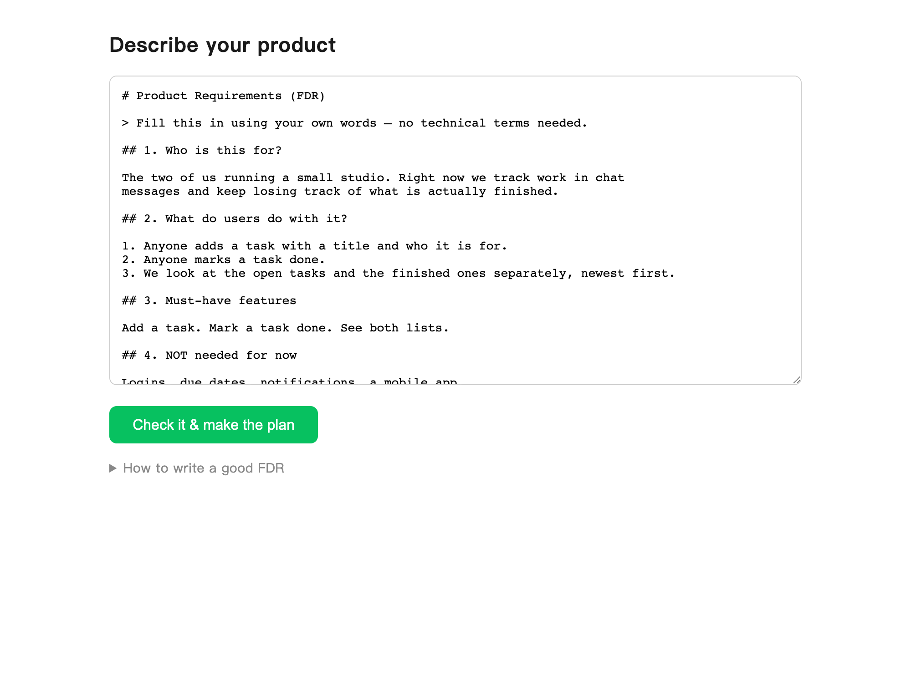

# autoproduct — AI product autopilot

**Finds what to build from your real signals. Sizes it honestly. Writes the
PRD. Builds, tests, and reviews the product. Measures whether it worked —
and forces the kill decision when it didn't.**

   [](https://pypi.org/project/autoproduct/)

A week of real product signals in — an evidence-gated product decision out:

```text
signals.yaml — support tickets + GitHub issues, verbatim:

  s1  "I started a build and stared at the terminal for 40 minutes with
       no idea whether it was progressing or stuck"
  s3  "show live build progress per task in studio — right now it looks
       frozen while it works"
  s4  "can I send a preview of the built product to my cofounder, a link
       she can open on her phone"
  s6  "how much will a typical month of builds cost me? I'm scared to
       leave autopilot running"
```

&nbsp;&nbsp;&nbsp;&nbsp;↓ &nbsp;`avs opportunity signals.yaml` → `market` → `prd` → *(build)* → `evidence`

- ✅ **4 grounded candidates** (Gate PL0) — every claim cites its ticket verbatim; each carries a falsifiable hypothesis and a *named cheapest test* ("ship a clickable mockup to the 3 reporters", not "build an MVP")
- ✅ **A market assessment its own voters attack** — the Sizing seat caught an ungrounded 0.15 affected-fraction inference; the Competitive seat caught "no competitor does this" resting on a single pricing-page probe; the dedicated Disconfirmation seat argues the other side on the same evidence
- ✅ **A PRD with teeth** (Gate PL2) — three kill criteria authored *before* anyone is attached, the sibling candidates explicitly listed as non-goals, and a Planning task auto-generated for the metric nobody had instrumented yet
- ✅ **A machine-checked handoff** into the build pipeline — Discovery reads exactly the PRD that passed the gate, or nothing
- ✅ **An honest verdict** (Gate PL4) — panel-open rate read at **24.0% (n=250, CI 19.1–29.7%)** against a 30% kill threshold → `insufficient_evidence`: the interval brushes the line, so the system says "here's the n it would take to know" instead of declaring victory

*(Every artifact above is unedited output from one real-provider run — see
[A real run](#a-real-run-unedited) below.)*



Two loops, one system. The **inner loop** builds: apps, web services, and
微信小程序 from a single plain-language requirements doc (the **FDR**) —
written by someone with no coding background, in their own words, English
or Chinese. The **outer loop** decides: it mines your owned signals for
opportunities, sizes markets bottom-up with mandatory sensitivity ranges,
writes PRDs with required kill criteria, measures real cohorts through a
privacy boundary, and routes every irreversible act — publishing, spending,
shipping, killing — to a named human at a recorded gate.

## Pick your door (one spine, three editions)

```bash
uvx avs replay --demo    # 2 minutes, NO API key: a real review's audit
                                 # trail, replayed offline — decide with evidence
avs init myco --profile web --edition solo         # or: enterprise | engineer
```

Editions are narrowing presets over the same unchanged pipeline — never
forks, never fewer checks (`edition_lint` refuses anything that widens):

- **[Solo / OPC 一人公司](editions/solo/START-HERE.md)** — built around your
  attention: one product bet, a 45-minute weekly review with the kill
  criteria first, safe publishing defaults.
- **[Enterprise / traditional industry](editions/enterprise/START-HERE.md)** —
  ships the procurement pack and the pilot-to-production contract; init
  refuses without a named gate owner.
- **[Engineer](editions/engineer/START-HERE.md)** — fixture-gated extension
  points; nothing unfixtured registers, and you're invited to try to
  break that.

## For founders (no technical background needed)

Three steps to the browser UI:

```bash
pip install ai-venture-studio      # 1. install — needs Python; `avs` appears on your PATH
export ANTHROPIC_API_KEY=...       # 2. the key that powers the build
avs studio myteam --profile web    # 3. serve the Studio for a new workspace
```

Then open **http://127.0.0.1:8433** in your browser. The Studio is
localhost-only: no account, no signup, nothing leaves your machine except
the model API calls. `myteam` is the folder your product is built into;
profiles are `web` | `miniprogram` | `app`. Coming back later? Run
`avs studio` from inside that folder — no flags needed. If `avs` says
"command not found", the install went into a different Python environment
— `uvx --from ai-venture-studio avs studio myteam --profile web` sidesteps
that entirely.

Want a look before handing over an API key? `avs replay --demo` prints a
complete review, offline, key-free.

The page header switches the view — **Founder** (default), **Engineer**,
**Enterprise** — or set the default with `--mode engineer`. Every view is
the same product; the deeper ones only add read-only detail.



English is the default. `--lang zh` gives the original bilingual UI for
微信小程序 founders, unchanged ([Chinese screenshot](docs/media/studio.png)) —
and your FDR may be written in either language whichever UI you choose.

Or the same flow in the terminal:

```bash
avs create myteam --profile web    # 1. writes FDR.md template + guide
# ← fill in FDR.md in your own words
avs create myteam --profile web    # 2. asks questions OR confirms the plan
avs create myteam --profile web --yes   # 3. builds everything
avs preview                        # 4. try your product
avs add feature.md --yes           # 5. one small FDR per new feature
avs ship                           # 6. deploy artifacts + plain-language guide
```

An FDR is six questions in your own words. This is the whole input for the
screenshot above:

```markdown
## 1. Who is this for?
The two of us running a small studio. Right now we track work in chat
messages and keep losing track of what is actually finished.

## 2. What do users do with it?
1. Anyone adds a task with a title and who it is for.
2. Anyone marks a task done.
3. We look at the open tasks and the finished ones separately, newest first.

## 3. Must-have features
Add a task. Mark a task done. See both lists.

## 4. NOT needed for now
Logins, due dates, notifications, a mobile app.

## 6. What does success look like?
The two of us stop tracking work in chat messages.
```

- **If your FDR is unclear, the system asks — it never guesses** (at most
  5 questions a non-technical person can answer, in your language).
- **One FDR = one thing.** The first FDR is the smallest usable product;
  every later feature is its own small FDR via `add`. Granular builds are
  more accurate and fail more debuggably.
- **You confirm intent in plain language** before anything is built, and
  get a build report in your language after — including every automated
  approval the machine made on your behalf.
- **Real persistence out of the box**: a local SQLite database is
  provisioned automatically; cloud services (Supabase, WeChat Cloud /
  微信云开发) are a guided option with credentials in a vault that never
  enters prompts.
- Profiles carry domain rules: web (CSRF/SSRF, a11y, E2E flows), mobile app
  (store rules, offline behaviour), game (simulation determinism, replay
  identity, bot playtests), data (freshness/row-count NFRs, lineage), and
  WeChat mini-programs / 小程序 (2MB package budget, domain whitelist, lazy
  authorisation with a privacy agreement, review boundaries).

## For product decisions (the outer loop)

```bash
avs opportunity signals.yaml         # P0: cluster real signals → candidates, Gate PL0
avs market cand-x --evidence probes.yaml   # P1: bottom-up sizing, six voters incl. Disconfirmation
avs market-approve --outcome pursue --scope-tier thin --decider you   # Gate PL1 (human)
avs prd                              # P2: PRD with kill criteria, planning tasks generated
avs prd-approve --decider you        # Gate PL2 + machine-checked handoff into the build
avs evidence events.yaml --metric build_progress_view_rate --cohort-start 2026-07-10
```

The rules that make it trustworthy are structural, not aspirational: every
quantitative claim is typed and machine-linted (`claim_lint` — unsourced
numbers, causal-language-without-a-holdout, and missing falsifiers fail the
gate); agents may never author a user quote or persona; sizing is a range,
never a point; person-level data cannot leave the analytics boundary (the
query errors); experiments are hash-pinned before exposure; the framework
never publishes, sends, or spends autonomously; and a fired kill criterion
cannot be closed without a recorded human decision.

## What happens under the hood

Fourteen gated stages across two loops (design docs:
[autoproduct-design](https://github.com/melodygaoyifan/autoproduct-design)):
Every doc is cross-referenced to its shipped mechanism in the
[implementation map](docs/implementation-map.md) — open items are named,
never silent.

**Outer loop (weeks-to-months):** Opportunity sensing (deterministic
clustering of owned signals, kill-registry memory) → Market & viability
(standing-checked probes, `injection_scan` over snapshots, a red-team
Disconfirmation voter) → PRD (kill criteria required at authoring time) →
… → Product evidence (cohort reads through a k-anonymity boundary,
attribution typed at the tool boundary) → Portfolio (mechanical
kill-criteria evaluation, append-only kill registry).

**Inner loop, upstream:** Discovery (evidence-tagged hypotheses —
fabricating user evidence is a schema violation) → Planning (task DAG with
cycle/lane/budget checks) → Spec (EARS criteria machine-linted, every
criterion covered by a test skeleton, frozen behind SCRs) → Coding
(single-writer, test-first, AST-checked no-test-weakening, sandboxed suite
must pass).

**Inner loop, downstream:** Code Review (6 heterogeneous voters,
deterministic probes for secrets/CSRF-SSRF/slopsquatting/wireup drift,
every finding independently verified) → Test Gate (isolated worktree,
mutation testing in deep mode) → Deploy Review → Maintenance (triage →
root cause → fix-PRs whose regression tests must fail pre-fix).

Every generative stage runs the same template: one writer, deterministic
tools first, independent charter voters (each fixture-gated at 8 cases,
≥87.5% to register), a fresh verify pass per finding, a leader synthesis,
and a gate — human wherever judgment is the point. Nothing auto-merges,
nothing deploys autonomously, nothing publishes, nothing spends.

## A real run (unedited)

Everything below is real-model output from one end-to-end run of the
opportunity chain (`opportunity` → `market` → `prd` → `evidence`) on the
signals shown at the top of this page. Signal texts and competitor-probe
pages are fixtures; every judgment, artifact, and number below was produced
by the pipeline, unedited.

**1. P0 turns four signals into grounded candidates (Gate PL0 passed):**

> **cand-build-progress** — Users cannot tell whether an in-progress build
> is advancing or stuck, so they need live per-task progress visibility.
> - hypothesis: live per-task progress stops long builds reading as frozen
> - falsifier: a prototype does not reduce "is it stuck?" reports
> - cheapest test: *ship a clickable mockup to the 3 ticket reporters and
>   count how many confirm it resolves their "frozen" uncertainty*

**2. P1's own voters attack the market case (three verified majors):**

> "…the revenue sizing hinges on an ungrounded 0.15 affected-fraction
> inference multiplied against the real 900-workspace base, the
> price-headroom positioning rests on only two vendors, and the Vendor B
> absence claim relies on a single pricing-page probe rather than a proper
> probe list."

The deterministic gate had already blocked an earlier draft outright: 75%
of its claims were `model_inference` against the 30% market ceiling —
reasoning dressed as research doesn't pass.

**3. P2 writes a PRD with its own death spelled out (Gate PL2):**

> - kill: *"fewer than 3 of 3 mockup reporters confirm it resolves their
>   'frozen' uncertainty"*
> - kill: *"build_progress_view_rate stays below 30% after 30 days"*
> - non-goals: the sibling candidates, by name (shareable previews, cost
>   visibility, dark mode)
> - generated Planning task: *instrument `build_progress_panel_viewed` so
>   O-1 is measurable before launch*

**4. P4 reads the cohort and refuses to flatter it (Gate PL4):**

```text
build_progress_view_rate: 0.240   n=250   CI [0.191, 0.297]   window complete
verdict H-1: insufficient_evidence — the interval brushes the 30% kill
threshold; the honest output is the n it would take to know, not a win.
```

The same machinery runs the other direction too: the inner loop's product
benchmark (`product-bench`) builds full products from plain-language FDRs
(English or Chinese) and
scores them with independent behavioral probes, reported unaveraged —
including the runs that fail.

## Measured

- **Review benchmark** (`avs bench`): recall 100%, precision 67%
  on 13 labeled cases (bars: 40%/50%).
- **Product benchmark** (`avs product-bench`): full FDR→product
  runs scored by *independent* behavioral probes executed against the
  built product ([WebGen-Bench](https://arxiv.org/abs/2505.03733)
  pattern) — build rate, probe pass rate, and clean-review rate reported
  unaveraged, with an honesty case proving probes can fail.
- **1112 hermetic tests** (`uv run pytest`); every PR in this repo was
  reviewed by avs itself, and five of those reviews caught real
  bugs. The first live smoke of the outer loop surfaced three wiring bugs
  — each caught by a gate doing its job, each now a regression test.

## For developers

| | |
|---|---|
| `opportunity` · `market` / `market-approve` · `prd` / `prd-approve` · `evidence` | the outer loop as one-command stages: writer → det tools → charter voters → verify → leader → gate; human decisions recorded at PL1/PL2 |
| `voter-gate <stage>` · `review-gate` | register voters against their 8-fixture gates (≥87.5%); failed voters stop voting — `review-gate` covers the six review seats, `voter-gate` every other family |
| `claim-lint` · `prd-lint` · `handoff-check` | outer-loop gates standalone: claim ledgers, PRD boundary/kill-criteria/instrumentation, the machine-checked P2→Stage-1 handoff |
| `preregister` · `experiment-check` | pin an experiment design before exposure; schema + FDR plan + power + pin integrity |
| `discover / plan / spec / build` (+ `*-approve`) | inner-loop upstream stages, gates U1–U4 |
| `scr` / `scr-approve` | the only legal way to change a built spec |
| `review` · `resume` · `recover` · `replay` | review pipeline, HITL, crash recovery (reviews, deploy reviews, and incidents all resume from their checkpoints), audit trail |
| `deploy-review` · `deploy-outcome` · `triage [--fix]` | Gates 5–6 |
| `automerge` · `deploy-execute` | merge/deploy only under a human-armed, attributed, expiring policy — disarmed by default ([ADR-031](docs/adr/031-policy-armed-automation.md)) |
| `serve` · `worker` · `tenant` | webhook mode + queue workers (SQLite, one host); `tenant add` fronts several isolated workspaces from one process ([ADR-030](docs/adr/030-multi-tenant-server.md)) |
| `botfleet` | bot playtests: N parallel sessions, triaged and deduped, each finding with a reproduction command — crashes and stuck states, never whether the game is fun |
| `bench-criterion` | the capability kill criterion (PRD O-L2): has product-bench fallen below its floors for two consecutive runs? |
| `attention` | the weekly maintenance-attention series the launch PRD's kill criterion is falsifiable by: the machine measures the observable floor from the ledgers, you log the hours |
| `loop` | where the live product cycle stands against the v3.0.0 design gate ([runbook](docs/v3-live-loop.md)) — states, never decides |
| `bench` · `product-bench` · `compound --pr` | the two benchmarks + the compounding loop |

Install: `pip install ai-venture-studio` ([PyPI](https://pypi.org/project/ai-venture-studio/)) — the command is `avs`, with `autoproduct` kept as an alias. The older `autoproduct` distribution is frozen at its last release — or clone this repo for the benchmarks, voter fixtures, and bench history.

Setup: `uv sync`, then **your own** `ANTHROPIC_API_KEY`. The repo ships
no keys, no proxy, and no metered backend: every provider call is billed
to the keys in *your* environment, keys are never written to the
workspace or git (the secrets layer resolves `secret://ENV` references
loudly and scrubs resolved values from outbound text), and every provider
errors loudly if its key is missing rather than running half-armed.
`OPENAI_API_KEY` optional but recommended: it puts a real GPT-5 in the
security and deploy-config voter seats, breaking same-family
self-preference when Claude reviews Claude-written code; without it those
seats visibly fall back (`substituted_from`).
`GEMINI_API_KEY`/`XAI_API_KEY` optional likewise. Optional
`AUTOPRODUCT_CHECKPOINT_KEY` encrypts checkpoint rows at rest — honored
or a loud error, never a silent plaintext fallback. Optional
`AUTOPRODUCT_TOOL_TRANSPORT=mcp` runs voter tools in subprocess-isolated
MCP servers instead of in-process ([ADR-029](docs/adr/029-mcp-transport-partial.md));
in-process is the default because a spawn per server per invocation is a
real cost you should choose deliberately. `gh` auth, Docker
optional (network-isolated test sandbox), Node optional (JS test gate).
Operations guide: [RUNBOOK.md](RUNBOOK.md).

## Honest limits (today)

- The outer loop runs end-to-end and survived its first real-provider
  smoke, but its release bar is honest: it is unproven until a real Gate
  PL5 records a real kill or pivot on a live cycle.
- Cloud services are guided, not auto-provisioned; deploys generate
  artifacts + instructions, and the button stays yours until you arm a
  policy that says otherwise ([ADR-031](docs/adr/031-policy-armed-automation.md)
  — disarmed by default, attributed, expiring).
- 小程序 page-level testing needs `miniprogram-simulate` installed;
  pure-logic modules are gated via `node --test` today.
- Single-machine operation; crash recovery resumes reviews, deploy
  reviews, and incidents from their checkpoints, but Celery/Redis
  multi-instance supervision remains the documented upgrade path.
- Multi-tenant isolation is filesystem-and-routing level, not OS-level: a
  Python-level RCE in the harness would cross tenants. If that is in your
  threat model, run one process per tenant ([ADR-030](docs/adr/030-multi-tenant-server.md)).

## Roadmap

<details>
<summary><b>v0.8 → v0.30</b> — the four downstream MASes, the founder autopilot, the adoption track, the outer product loop, domain profiles, the Sweep role, and the two audit gap-closure passes (22 releases, expand for the record)</summary>

| | |
|---|---|
| v0.8 ✅ | all four downstream stage MASes (code review, test gate, deploy review, maintenance) |
| v0.9 ✅ | greenfield autopilot for non-technical founders (FDR → product) |
| v0.10 ✅ | founder experience complete + measured (Studio UI, product benchmark) |
| v0.11–v0.12 ✅ | traditional-industry adoption track + hardening |
| v0.13 ✅ | product-loop substrate: typed claim ledger, `claim_lint`, evidence snapshots, synthetic-persona scan, source standing, `user_data_taint` |
| v0.14 ✅ | safe-publish: the seven deterministic marketing backstops, channel profiles, Gate PL3 scoped approvals — a human presses every publish button, and it never spends money |
| v0.15 ✅ | evidence: analytics/feedback privacy boundary, metric vocabulary with baseline-resetting definitions, cohort reads with sufficiency teeth, attribution typed at the tool boundary — only holdouts ground causal claims |
| v0.16 ✅ | upstream P0–P2: opportunity sensing, market & viability, PRD with required kill criteria, machine-checked handoff into Discovery |
| v0.17 ✅ | experiments: hash-pinned pre-registration, two-stage FDR-controlled screening→validation, sequential peeking, guardrail vetoes, inconclusive-enters-nothing |
| v0.18 ✅ | closed loop: `evaluate_kill_criteria` (a fired criterion cannot close without a recorded human decision), append-only kill registry, hypothesis reconciliation, the five loop metrics |
| v0.19–v0.20 ✅ | the outer loop operable end-to-end: gate CLIs, then the four LLM stages as one-command runs; first real-provider smoke (three wiring bugs found by gates, fixed); 24 voter fixture-registration gates + `voter-gate` |
| M2–M7 ✅ | build screenshots (gated-visible), in-Studio correction loop with SCR-backed scope changes, 验收清单 walkthrough, telemetry + digest, 微信支付/登录/订阅 blocks, estimate hints + undo |
| v0.21 ✅ | platform editions + distribution (docs 24–25): `init --edition` with narrowing-only `edition_lint`, the three START-HERE doors + weekly founder review + procurement pack, `replay --demo` (a real audit trail, offline, no API key), `--from-bench` templates that are the benchmark fixtures, opt-in aggregate-only `telemetry`, the published [benchmark page](docs/benchmark.md), and ADR-U29: this README is checked against [claims/platform.yaml](claims/platform.yaml) by the test suite — asserting beyond the ledger fails the build |
| v0.22 ✅ | the launch pass, prepared (P20): [launch/](launch/) holds the platform's own PRD (kill criterion: 4 weeks over the attention budget cuts scope at Gate PL5), a launch post that survives all its own backstops, and a hash-pinned pre-registered experiment whose power check honestly returns BLOCKED at current traffic — the suite keeps all three green; plus CONTRIBUTING (gated contributions, bus-factor-1 honesty, watch items with falsifiers) |
| v0.23 ✅ | complex-systems gap closure, deterministic core (docs 26–28, P21–P26): lintable perf ACs + VALID/INVALID load-run typing + `capacity.yaml` headroom arithmetic (perf lane calibrated: see roadmap v0.24); realtime delta (`det_sim_scan`, replay-identity/cross-build/desync checks, tick budgets); streaming delta (`stream_contract_check` — the word "default" is lexically illegal, exactly-once typed-or-downgraded, backpressure scan); architecture fitness (`deps.yaml` graph → `arch_contract_check`, brownfield checkpoint debt); delivery hardening (environment promotion DAG, `flag_lint` with owners+expiry, `migration_rehearsal` with reversibility round-trip) |
| v0.24 ✅ | lane execution wrappers + calibration: k6 scripts compiled from perf ACs (thresholds ARE the AC; absent binary = visible skip with the script on record), netem condition profiles with gated apply, schema-registry wrapper + contract-file reconciliation — and the seeded perf-defect calibration ran for real: 5 of 5 defects caught at the 3x relative-detection factor (loopback, low parity, honestly scoped — satisfies no AC), converting the lane from PROVISIONAL to CALIBRATED |
| v0.25 ✅ | the Sweep role (doc 29): `avs sweep` harvests the maintenance queues the ledgers already keep (expired flags, checkpoint debt, stale claims/capacity, due watch items, contract drift), patches only allowlisted chores under the behavior-preservation contract (out-of-scope diffs abort), caps open PRs to the attention budget, records clean passes with a snapshot hash, and alarms on over-action — SW0 report-only by default, promotion is your recorded decision at the weekly review |
| v0.26 ✅ | full design-doc cross-reference (docs 08–29 audited against the code): the [implementation map](docs/implementation-map.md) records every doc's shipped mechanism, tag, and named open items; gap-closure code from the audit — `operations-policy.yaml` (per-stage WIP + the shed rule + ci_concurrency), the `hot-files.yaml` shared-file registry + `lane_check`, the four 小程序 preflights (`mp_size_check`/`mp_domain_check`/`mp_setdata_lint`/`mp_privacy_check`), and `profiles/game.yaml` |
| v0.27 ✅ | audit gap closures, round two: GitHub Actions CI (the suite — including the self-linting README — now runs on every push, making "fails CI" literal), the §41.1 structured profile schema (add-only, composable), doc-16's cascade policy with the model-family heterogeneity floor + serial merge-queue admission (sweep never starves features) + the `gepa.yaml` budget schema (proposer-off by default), and the debt tools (radon/jscpd/vulture, availability-gated, feeding Sweep's queues) |
| v0.28 ✅ | gap-closure plan + phase A ([the plan](docs/gap-closure-plan.md) is a committed artifact; phases B–D queued): web det-tool runners (axe/Lighthouse/size-limit, gated), the data NFR grammar + lineage impact check, the full typed upstream verdict vocabulary, Gate P1 platform preflight (stale checklists and evidence-free checkboxes both fail; a named human submits), data-classification tags with downgrade refusal, and CHANGELOG.md |
| v0.29 ✅ | plan phase B: five profile voter charters (web DesignFidelity/A11ySemantics/PerformanceDelta, 小程序 PlatformFit, app DeviceReality) and 8-fixture registration gates for them AND the three data voters — `voter-gate web\|miniprogram\|app\|data` now serves every family under the same 87.5% contract |
| v0.30 ✅ | plan phase C: the cost/observability ledger (prices are config never constants, unpriced calls counted never zeroed, the monthly cap warns and a human decides; per-review tool-audit + evidence-ledger receipts; `/metrics` in Prometheus text, aggregate-only), the module-spec invariant layer (`.mas/specs/*.spec.yaml` — `SPEC_DRIFT_UNDOCUMENTED` on unexpected change patterns, forbidden side effects scanned in diffs), and named signal webhooks (`/webhooks/sentry\|datadog\|pagerduty` → the incident inbox, bearer-authed, deduped) |

</details>

| | |
|---|---|
| v0.31 ✅ | plan phase D, first half: the GEPA proposer loop (budget-gated by `gepa.yaml`, holdout-scored through the same fixture gate voters register through, proposal records only — nothing self-installs) and the secrets layer (`secret://ENV` loud resolution, masked repr, outbound scrub) |
| v0.32 ✅ | plan phase D13: the discover/plan/spec critics as fourteen registered charter voters on the shared stage engine (each behind its 8-fixture gate; failed gates exclude the voter, unregistered voters are reported), retiring the single-panel critique prompts — `voter-gate discovery\|planning\|spec` |
| v0.33 ✅ | plan phase D15 + D16 remainder: deploy review and maintenance rebuilt as checkpointed graphs on the shared saver — a crash mid-vote resumes from the last completed super-step via `recover` instead of re-paying the pipeline — and checkpoint rows encrypted at rest under `AUTOPRODUCT_CHECKPOINT_KEY` (honored or loud error, never silent plaintext; mirrors stay readable on purpose) |
| v0.34 ✅ | Studio live progress + the wire-up gate: the building page shows per-task state updating in place (signals s1/s3 — no more staring at a frozen page), interrupted builds surface per-module 继续 buttons instead of a dead confirm screen, and a bidirectional frontend↔backend wire-up test — every rendered button/link/fetch must resolve to a route, every route must be rendered by some state |
| v0.35.0 ✅ | the last small open items: registration gates for the six review voters (8 fixtures each, run through the real seat; the vote node fails closed and refuses to review with no roster), per-project `policy:` thresholds in `project.yaml` (unknown keys are a loud error, ranges bounded, a weakened bar stamped into the verdict), and the ready-queue fix — `next_tasks` read a field that never existed, so the plan never advanced past task one |
| v0.36.0 ✅ | the instrument for the v3.0.0 design gate: `avs loop` reads the cycle's own artifacts and reports the three criteria — and refuses to call the gate met on a quiet cycle or a recorded 'continue', because the gate is about the loop's ability to *stop* ([runbook](docs/v3-live-loop.md)) |
| v0.37.0 ✅ | MCP becomes the real internal tool transport (doc 11 §17): two subprocess-isolated partitions (`read_only`, `code_intel`) speaking JSON-RPC over stdio, the spec→host→server triple check where an unlisted tool is *unreachable* rather than refused, and the `mcp-audit` ledger recording every call with digested arguments — opt in with `AUTOPRODUCT_TOOL_TRANSPORT=mcp` |
| v0.38.0 ✅ | multi-tenant server mode ([ADR-030](docs/adr/030-multi-tenant-server.md), a recorded reversal of a non-goal — the server half only, never SaaS): token→workspace resolution where workspaces must be provably disjoint, per-tenant `secret://` webhook secrets, tenant-scoped reads, and uniform 401s that never enumerate tenants; plus [docs/adr/](docs/adr/) recording every reversal |
| v0.39.0 ✅ | policy-armed automation ([ADR-031](docs/adr/031-policy-armed-automation.md), the hardest reversal): `automerge` and `deploy-execute` exist but stay disarmed until a human writes an attributed, expiring policy naming exact branches — earned by track record, blocked on sensitive paths including the policy files themselves, and logging refusals as carefully as actions |
| v0.40.0 ✅ | the L1/L2 MCP partitions (deploy probes, maintenance correlation, and test execution — five subprocess servers now) with risk-tier RBAC: a partition above the caller's declared ceiling is never mounted, and the audit ledger finally covers the tools that touch the most; plus the deploy-branch fix, where an unresolvable branch is a refusal rather than an assumed `main` |
| v0.41.0 ✅ | the Context Manifest (content-hashed context assembly, grounding receipts where an unread contract is a violation, drift detection that refuses to build a spec edited outside the SCR channel, and overflow routed to Planning as a split) and research-session taint isolation (ADR-U03: consume research and the run loses L1+ tools for good, enforced at the transport rather than in a prompt) |
| v0.42.0 ✅ | grounding enforced on every build: the manifest is assembled, recorded, and checked against the prompt, so a required contract that never reached the writer blocks the build — which immediately found that module-spec invariants were absent from the implementer's prompt while Code Review enforced them, and they are now quoted verbatim |
| v0.43.0 ✅ | the first external-service tool (`sentry_get_issue` in the L1 maintenance partition): credential via `secret://`, a visible skip when unset, read-only by construction, and its payload wrapped as untrusted research so a hostile issue title is data rather than an instruction — wired into incident intake, and honest that it has not yet run against a live org |
| v0.44.0 ✅ | all six §17.2 signal readers (sentry, datadog, pagerduty, prometheus, loki, jaeger) over one shared read-only core, with two honestly-distinguished gating families — credential for hosted services, base URL for self-hosted ones, and a visible skip naming the variable either way |
| v0.45.0 ✅ | the deploy-side CLI wrappers (terraform/helm/kubectl/argocd/flagger/railway) complete §17.2's tool table: binaries gated on installation rather than credentials, read-only by construction (no sync/rollback/apply outside `--dry-run`, asserted on the source), and `kubectl_dry_run` client-side by default so a review never silently reaches into whatever cluster is current |
| v0.46.0 ✅ | the attention collector: `avs attention` derives the observable floor from gate dwell and recorded decisions, refuses to author the number itself, keeps the series append-only, and exits 3 demanding a human decision the moment four consecutive logged weeks breach the budget — the v3.0.0 blocker was an unautomated habit, not a missing four weeks |
| v0.47.0 ✅ | the bot fleet (doc 17 §45.2's last unbuilt check): defined by a session protocol rather than by a game, so its detectors are verified against real sessions of a real deterministic sim — and the first real run immediately found a dedupe bug that a stubbed stream would have hidden |
| v0.48.0 ✅ | upstream resume (a crashed `create` skips tasks already built instead of re-paying them — task-granular, and said so plainly), grounding extended to the spec writer (which immediately showed the spec writer never saw CLAUDE.md or the module invariants it must not contradict), and the gap-closure plan closed out |
| v0.49.0 ✅ | the use-case matrix: every profile builds, every edition narrows, every substrate rung activates exactly what its floors allow — which found that six of eight stages knew their infrastructure floor without enforcing it (an S0 team with no git could still run `build`), now fixed and pinned in both directions |
| v0.50.0 ✅ | `loop` and `attention` joined: the gate report now names the real distance to firing and the exact command to run next, and reports a `not_tracked` week as the recorded decision it is rather than as logged or as a gap |
| v0.51.0 ✅ | a second kill-criterion axis, chosen by the human and evaluated by the machine: product-bench capability regression, whose series is already collected weekly — so unlike the attention axis it can fire on the next run, with floors read off the observed distribution rather than picked |
| v0.52.0 ✅ | the Studio speaks English (`--lang en`): every string in a per-language table, an English FDR template, and the README's founder demo replaced with an English-first walkthrough plus a real screenshot of the real UI — the demo previously claimed English while showing a Chinese interface |
| v0.53.0 ✅ | renamed to **ai-venture-studio** (live links updated; recorded evidence locators left as recorded, with a rename note, because a snapshot is not edited after the fact) and English became the Studio default — `--lang zh` restores the original bilingual UI character for character |
| v0.54.0 ✅ | package + CLI renamed to match: `import ai_venture_studio`, command **`avs`** (with `autoproduct` kept as an alias so nothing scripted breaks) — while env vars, Prometheus series, telemetry keys and the CLAUDE.md section header were deliberately left alone, because renaming a wire format silently breaks its consumers |
| v0.55.0 ✅ | Studio modes (`--mode founder\|engineer\|enterprise`): the mode resolves from the workspace edition so different users get different depths of the same UI — founder unchanged and default, engineer adds task IDs/states and the CLI equivalent of every button, enterprise adds the resolved edition's governance facts and the attestation-ledger count. Modes only ever ADD visibility (tested structurally: every founder form survives in every mode) |
| v0.56.0 ✅ | per-mode UIs, researched then built: the mode is now adaptable per request (visible switcher on every page, `?mode=` + cookie, never auto-flipped — Findlater & McGrenere CHI 2004), engineer mode gains the review timeline in the browser (`/review/<id>`, the mirror `avs replay` reads) and a voter-health board, enterprise mode gains attestation *chain verification* (tampering renders as BROKEN-at-entry-N, not a line count), the S0–S4 stage-activation grid, the F-18.3 dwell/rubber-stamp report, and automation arming state — every card a pure read of files the CLI already writes |
| next 🔜 | the v3.0.0 design gate itself: this repo's cycle sits at V3-1/V3-2 met, V3-3 pending — the launch PRD's kill criterion needs four consecutive logged attention weeks, and a human records the decision |

## Star history

[](https://star-history.com/#melodygaoyifan/ai-venture-studio)

---

MIT · design docs: [autoproduct-design](https://github.com/melodygaoyifan/autoproduct-design)
