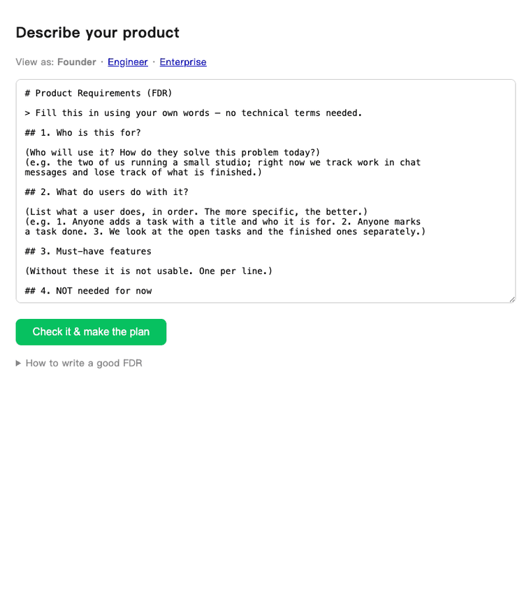

# AI Venture Studio (`avs`)

**AI Venture Studio is an open-source multi-agent system that takes one
plain-language requirements document and plans, builds, tests, reviews, and
ships the product — with a human approving every irreversible step.** It also
runs the loop around the loop: it finds what to build from your real user
signals, sizes it honestly, writes the PRD with kill criteria, measures
whether it worked — and forces the kill decision when it didn't.

[](https://github.com/melodygaoyifan/ai-venture-studio/actions/workflows/ci.yml)
[](https://pypi.org/project/ai-venture-studio/)


Try it in two minutes, no API key:

```bash
uvx --from ai-venture-studio avs replay --demo
```

That replays a real review of this repo's own code from its vendored audit
trail, offline — including the run where the pipeline escalated to a human
instead of guessing.

> **This README cannot overclaim.** Every quantitative claim in it is
> machine-checked in CI against [claims/platform.yaml](claims/platform.yaml)
> — a number that was not measured, or a superlative about anyone else,
> fails the build (ADR-U29).

## Pick your door

One spine, three editions — narrowing presets over the same unchanged
pipeline, never forks, never fewer checks (`edition_lint` refuses anything
that widens):

- **[Solo founder / OPC 一人公司](editions/solo/START-HERE.md)** — built
  around your attention: one product bet, a 45-minute weekly review with the
  kill criteria first, safe publishing defaults. FDRs in English or Chinese.
- **[Engineer](editions/engineer/START-HERE.md)** — fixture-gated extension
  points; nothing unfixtured registers, and you're invited to try to break
  that.
- **[Enterprise / traditional industry](editions/enterprise/START-HERE.md)**
  — ships the procurement pack and the pilot-to-production contract; init
  refuses without a named gate owner.

## For founders (no technical background needed)

Three steps to the browser UI:

```bash
pip install ai-venture-studio      # 1. install — `avs` appears on your PATH
export ANTHROPIC_API_KEY=...       # 2. the key that powers the build
avs studio myteam --profile web    # 3. serve the Studio for a new workspace
```

Then open **http://127.0.0.1:8433**. The Studio is localhost-only: no
account, no signup, nothing leaves your machine except the model API calls.
Profiles: `web` | `miniprogram` | `app`. Returning later is just
`avs studio` from inside the folder. (Wrong Python environment? `uvx --from
ai-venture-studio avs studio myteam --profile web` sidesteps it.)



*One real run, unedited — a live provider, no mock, nothing composited.
Plain language in; a plan comes back for confirmation; modules build with
live per-task progress; the report says in your own words what works and
what doesn't; the last frame is the product that run actually produced.
That report reads "partly built" because some modules failed — it names
them, keeps the rest working, and offers a retry per module. This is what
a real run looks like, which is the only kind of demo this repo will ship
([single screen](docs/media/studio-en.png) · [Chinese UI](docs/media/studio.png)).*

English is the default (`--lang en`); `--lang zh` gives the original bilingual UI for
微信小程序 founders. The page
header switches the view — **Founder**, **Engineer**, **Enterprise** — and
deeper views only add read-only detail.

Your entire input is an **FDR**: six questions answered in your own words.
The one that produced the run above:

```markdown
## 1. Who is this for?
The two of us running a small studio. Right now we track work in chat
messages and keep losing track of what is actually finished.

## 2. What do users do with it?
1. Anyone adds a task with a title and who it is for.
2. Anyone marks a task done.
3. We look at the open tasks and the finished ones separately, newest first.

## 3. Must-have features
Add a task. Mark a task done. See both lists.

## 4. NOT needed for now
Logins, due dates, notifications, a mobile app.

## 6. What does success look like?
The two of us stop tracking work in chat messages.
```

- **If your FDR is unclear, the system asks — it never guesses** (at most
  5 questions a non-technical person can answer, in your language).
- **One FDR = one thing.** The first FDR is the smallest usable product;
  every later feature is its own small FDR. Small builds are more accurate
  and fail more debuggably.
- **You confirm intent in plain language before anything is built**, and get
  a build report in your language after — including every automated approval
  the machine made on your behalf.
- **You can see what it is doing while it does it.** Each module narrates its
  own steps as they start — working out how to build it, writing the code
  (attempt 2 of 3), running your tests, checking that it actually starts up —
  in the terminal and in the Studio. No percentages and no ETA: the system
  does not know whether attempt 2 will be the last one, and a made-up number
  is worse than an honest step.
- **A module that fails says why.** Not "the build gate failed" but the test
  that failed, or that the model's answer was cut off and the task needs
  splitting. Every attempt is kept for inspection.
- Real persistence out of the box (local SQLite; Supabase and WeChat Cloud
  微信云开发 are guided options with credentials in a vault that never
  enters prompts).

The same flow runs in the terminal: `avs create` → `avs preview` →
`avs add` → `avs ship` ([full founder walkthrough](RUNBOOK.md)).

## What happens when you press build?

Fourteen gated stages across two loops, and every generative stage runs the
same template: one writer, deterministic tools first, independent charter
voters (each fixture-gated at 8 cases, ≥87.5% to register), a fresh verify
pass per finding, a leader synthesis, and a gate — human wherever judgment
is the point. Nothing auto-merges, nothing deploys autonomously, nothing
publishes, nothing spends.

The full design is public — fourteen documents, cross-referenced to shipped
code in the [implementation map](docs/implementation-map.md) (open items are
named, never silent): [autoproduct-design](https://github.com/melodygaoyifan/autoproduct-design).

## A real run (unedited)

Real support tickets in, an evidence-gated product decision out. Signals,
verbatim from the tracker:

```text
s1  "I started a build and stared at the terminal for 40 minutes with
     no idea whether it was progressing or stuck"
s6  "how much will a typical month of builds cost me? I'm scared to
     leave autopilot running"
```

`avs opportunity` → `market` → `prd` → `evidence`. Every artifact below is
unedited pipeline output from one real-provider run:


1. **P0 turns the signals into grounded candidates** (Gate PL0) — every
   claim cites its ticket verbatim, each carries a falsifiable hypothesis
   and a *named cheapest test* ("ship a clickable mockup to the 3
   reporters", not "build an MVP").
2. **P1's own voters attack the market case** — the Sizing seat caught an
   ungrounded 0.15 affected-fraction inference; the dedicated
   Disconfirmation seat argues the other side of the same evidence. The
   deterministic gate had already blocked an earlier draft outright: 75% of
   its claims were `model_inference` against the 30% market ceiling —
   reasoning dressed as research doesn't pass.
3. **P2 writes a PRD with its own death spelled out** (Gate PL2) — kill
   criteria authored before anyone is attached, sibling candidates listed
   as non-goals by name, and a Planning task auto-generated for the metric
   nobody had instrumented yet.
4. **P4 reads the cohort and refuses to flatter it:**

```text
build_progress_view_rate: 0.240   n=250   CI [0.191, 0.297]   window complete
verdict H-1: insufficient_evidence — the interval brushes the 30% kill
threshold; the honest output is the n it would take to know, not a win.
```

## What has been measured?

Numbers below link to their evidence; the CI-enforced ledger entry for each
is in [claims/platform.yaml](claims/platform.yaml).

- **Review benchmark** (`avs bench`): recall 100%, precision 67% on 13
  labeled cases against bars of 40% and 50%
  ([cases](benchmarks/cases), [method](docs/benchmark.md)).
- **Product benchmark** (`avs product-bench`): full FDR→product runs scored
  by *independent* behavioral probes executed against the built product
  ([WebGen-Bench](https://arxiv.org/abs/2505.03733) pattern), reported
  unaveraged across synthetic and real case sets. Synthetic cases
  (2026-07-23, n=1, claude-opus-4-8 writer): build 100%, probe pass 83.3%,
  clean review 100%. Real cases, run 5 (2026-07-26, n=1, pre-fix baseline):
  build 33%, probe pass 0%, clean review 17% — **published because a
  benchmark you can only pass is marketing; one you can fail in public is
  evidence** ([full run history](benchmarks/results/HISTORY.md)).
- **Perf-lane calibration**: 5 of 5 seeded defects caught (catch rate 100%)
  at the 3x relative-detection factor, loopback low-parity environment,
  2026-07-26 ([manifest](benchmarks/perf_seeded/calibration.yaml)).
- **1366 hermetic tests** (`uv run pytest`, no network, no keys); every PR
  in this repo was reviewed by avs itself, and five of those reviews caught
  real bugs.

## How does it compare?

Orchestration SDKs and app builders are complements at a different layer —
you can keep their mental models and still adopt this repo's lifecycle,
gates, and evidence discipline. No scores, no adjectives; just the layer
split:

| | Layer | Opinion held | Opinion delegated |
|---|---|---|---|
| Orchestration SDKs (LangGraph, CrewAI, agent SDKs) | build agents | how agents compose and communicate | what your team's lifecycle, gates, and evidence standards are |
| Chat-to-app builders | generate an app from a conversation | speed from prompt to running code | what happens after: review depth, launch honesty, the kill decision |
| **AI Venture Studio** | run a product lifecycle | which decisions need a human, which claims need evidence, and when a product must die | which model families do the judging (swappable seats) |

## Limitations

- The outer loop runs end-to-end and survived its first real-provider
  smoke, but its release bar is honest: it is unproven until a real Gate
  PL5 records a real kill or pivot on a live cycle.
- Cloud services are guided, not auto-provisioned; deploys generate
  artifacts + instructions, and the button stays yours until you arm a
  policy that says otherwise ([ADR-031](docs/adr/031-policy-armed-automation.md)
  — disarmed by default, attributed, expiring).
- 小程序 page-level testing needs `miniprogram-simulate` installed;
  pure-logic modules are gated via `node --test` today.
- Single-machine operation; crash recovery resumes reviews, deploy reviews,
  and incidents from their checkpoints, but multi-instance supervision
  remains the documented upgrade path.
- Multi-tenant isolation is filesystem-and-routing level, not OS-level
  ([ADR-030](docs/adr/030-multi-tenant-server.md)); if that is in your
  threat model, run one process per tenant.

## For developers

```bash
pip install ai-venture-studio   # the command is `avs` (`autoproduct` kept as an alias)
```

The repo ships no keys, no proxy, and no metered backend: every provider
call bills the keys in *your* environment, and every provider errors loudly
if its key is missing rather than running half-armed. `OPENAI_API_KEY` is
optional but recommended — it puts a different model family in the security
voter seat, breaking same-family self-preference when Claude reviews
Claude-written code. Setup, env vars, and operations: [RUNBOOK.md](RUNBOOK.md).

<details>
<summary><b>The CLI at a glance</b> (every stage is one command; full table in the RUNBOOK)</summary>

| | |
|---|---|
| `opportunity` · `market` · `prd` · `evidence` (+ `*-approve`) | the outer loop as one-command stages; human decisions recorded at gates PL1/PL2 |
| `discover / plan / spec / build` (+ `*-approve`) | inner-loop upstream stages, gates U1–U4; `scr` is the only legal way to change a built spec |
| `review` · `resume` · `replay` · `recover` | the review pipeline, HITL, audit trail, crash recovery |
| `deploy-review` · `triage [--fix]` | deploy gate and production maintenance |
| `bench` · `product-bench` · `voter-gate` · `compound --pr` | the benchmarks, voter registration gates, and the weekly compounding loop |
| `automerge` · `deploy-execute` | exist but stay disarmed until a human writes an attributed, expiring policy ([ADR-031](docs/adr/031-policy-armed-automation.md)) |
| `readiness` · `attest` · `cab-package` · `sweep` | the enterprise adoption surface: substrate ladder, attestation ledger, change control, the janitor |

</details>

## FAQ

### Can it build an app from a plain-English description?

Yes — that is the founder flow: one FDR (six questions in your own words,
English or Chinese) goes in; a planned, built, tested, and reviewed product
comes out, with your plain-language confirmation gate before any build
starts. The product benchmark exercises exactly this path end to end.

### Do I need to know how to code?

No. The Studio UI asks for your product description in your own words,
asks clarifying questions when it is unclear, and reports back in plain
language — including an acceptance walkthrough you can click through. You
never have to read the code it writes (it's yours, though).

### What does it refuse to do autonomously?

Merge to main, deploy to production, publish, send, spend money, fabricate
user evidence, or close a fired kill criterion. Each of these requires a
recorded human decision; merge/deploy automation exists but is disarmed
until a human writes an attributed, expiring policy naming exact branches.

### Does my data leave my machine?

Only model API calls, billed to your own keys. There is no account, no
proxy, and no metered backend; telemetry is off by default and aggregate-only
if you opt in (`avs telemetry show` prints the exact payload before anything
sends). Credentials live in a vault layer that never enters prompts.

### What happens when a build fails?

Failed modules are preserved for post-mortem, the rest of the product keeps
working, and the Studio offers per-module retry — an interrupted build
resumes from what is already built instead of re-paying it. Review verdicts
and gate records stay on disk as YAML you can replay.

### How is this different from an orchestration SDK like LangGraph or CrewAI?

Different layer: SDKs give you primitives to build agents; this is an
opinionated product lifecycle that happens to be run by agents — with the
opinions (gates, evidence rules, kill criteria) enforced by deterministic
code, and the judging seats swappable across model families. See
[How does it compare?](#how-does-it-compare) above.

## Status

Current release: see the [PyPI badge](https://pypi.org/project/ai-venture-studio/)
and [CHANGELOG.md](CHANGELOG.md); the release-by-release record back to
v0.8 is in [docs/release-history.md](docs/release-history.md). Next
milestone: the v3.0.0 design gate — the launch PRD's kill criterion needs
four consecutive logged attention weeks, and a human records the decision
([runbook](docs/v3-live-loop.md)).

---

MIT · design docs: [autoproduct-design](https://github.com/melodygaoyifan/autoproduct-design) · operations: [RUNBOOK.md](RUNBOOK.md) · security: [SECURITY.md](SECURITY.md)
